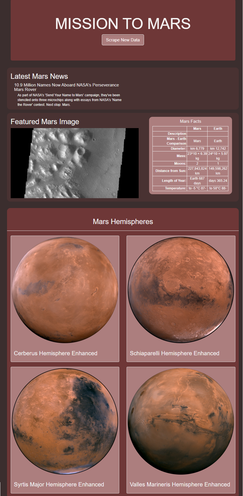

# Mission to Mars: Scraping data from Mars websites to create a new Mars website

## Overview
Mars enthusiast Robin would like to create a website focused on Mars to attract the attention of NASA.  To create this website, news articles, images, and an html table were scraped from four websites using a python script.  The data was stored in MongoDB for usage in a flask application implementing bootstrap 3.  The website primarily exists as a static display piece, but there is a "scrape new data" button that queries for the newest information, stores it in MongoDB and then updates the information displayed on the website.

## Tools
- `Python 3.7` using `splinter`, `BeautifulSoup`, `Pandas`, `webdriver_manager.chrome`, `Flask`, and `flask_pymongo`
- `MongoDB`
- `Bootstrap 3`

## Expected Display

